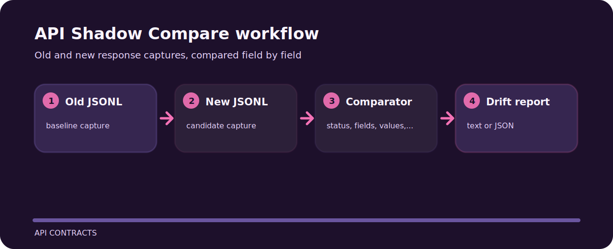

# API Shadow Compare

Old and new response captures, compared field by field. The repo is kept small on purpose: clone it, run the sample, inspect the output, then adapt the idea.


## Working map



## First run

```bash
git clone https://github.com/mertefekurt/api-shadow-compare.git
cd api-shadow-compare
python -m pip install -e ".[dev]"
api-shadow-compare examples/old.jsonl examples/new.jsonl
api-shadow-compare examples/old.jsonl examples/new.jsonl --json
```

## File map

```text
.github/        CI workflow
examples/       sample inputs
src/            package source
tests/          test coverage
.gitignore      project file
```
