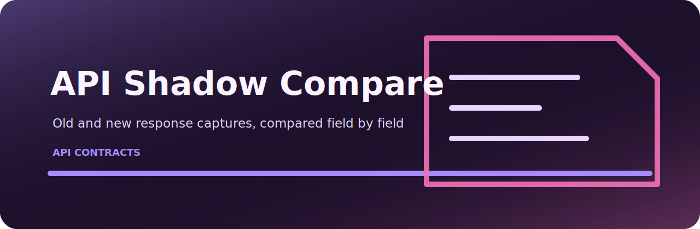

# API Shadow Compare

<p align="center">
  
</p>

Compare old and new API response captures for behavior drift.

## Working notes

- quick local checks around API operations
- small CI jobs where a readable report is enough
- review workflows that need deterministic output
- examples based on `examples/old.jsonl`

## Install

```bash
git clone https://github.com/mertefekurt/api-shadow-compare.git
cd api-shadow-compare
python -m venv .venv
source .venv/bin/activate
python -m pip install -e ".[dev]"
```

## Use

```bash
api-shadow-compare examples/old.jsonl
```

## Files

```text
.github/        CI workflow
examples/       sample inputs
src/            package source
tests/          test coverage
.gitignore      project file
pyproject.toml  package metadata
```
