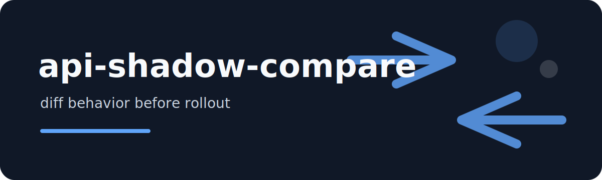

<p align="center"></p>

# api-shadow-compare

Compare two API captures: one from the current path, one from a shadow path. The tool matches rows by `id`,
flattens JSON responses, and reports behavior drift that should be reviewed before rollout.

## Files

```json
{"id":"req-1","status":200,"latency_ms":80,"body":{"plan":"pro","limit":10}}
```

## Command

```bash
api-shadow-compare examples/old.jsonl examples/new.jsonl --latency-ratio 1.5
api-shadow-compare examples/old.jsonl examples/new.jsonl --json
```

## Drift classes

| class | example |
| --- | --- |
| `missing-response` | old capture has an id that new capture dropped |
| `status-change` | `200` became `500` |
| `field-added` / `field-removed` | response shape changed |
| `value-change` | same field, different scalar value |
| `latency-regression` | new latency exceeds ratio threshold |

## Exit behavior

Returns `1` when drift is found and `0` when captures match. That makes it useful in CI shadow tests.

MIT.
